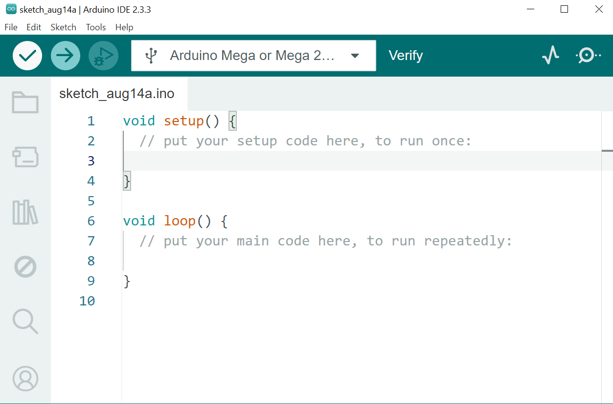
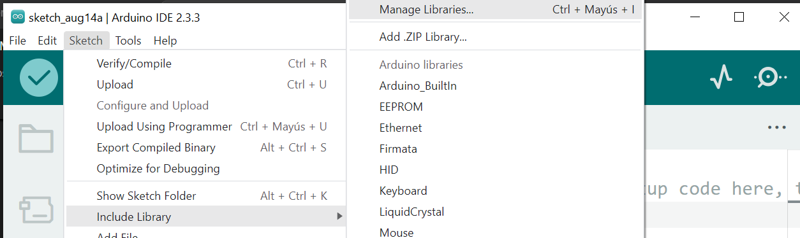
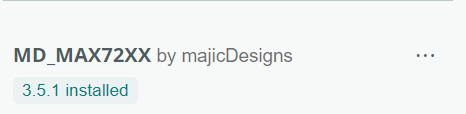

# :pager: Display

Este documento detalla las librerias a usar, conexiones y ejecucion de proyectos en los que se usan distintos modulos de visualizacion.

Proyectos:

1. Mensaje desplizable en matriz de leds 8x8 MAX7219.

Esta carpeta contiene ejemplos prácticos para la conexion y modificacion de Script y ejecucion de cada proyecto.

---

## :open_file_folder: Archivos incluidos

| Archivo         | Descripción                            |
| --------------- | -------------------------------------- |
| matriz_leds.ino | Proyecto de Medidor de Umbral de Ruido |

---

## :wrench: Requisitos de Hardware

- Arduino MEGA.
- Matriz de leds 8x8 MAX7219.

---

## 1. :inbox_tray: Instalar Arduino IDE

Como primer paso tener instalado el IDE de Arduino para poder compilar el codigo al arduino MEGA, Si no cuenta con esté software podrá descargarlo siguiendo los pasos aqui mencionados:

1. Ve al sitio oficial: [https://www.arduino.cc/env/software](https://www.arduino.cc/en/software)
2. Descarga la versión para tu sistema operativo (Windows, macOS o Linux).
3. Instala Arduino IDE siguiendo las instrucciones del instalador.

## 

---

## 2. :ballot_box_with_check: Instalar las librerias requeridas

Esta seccion es necesaria debido a que Arduino IDE no cuenta con librerias especificas para los distintos modulos y fabricantes, aqui vamos a instalar solo las requeridas para los distintos proyectos.

### 2.1 Abre Arduino IDE.

### 2.2 Ve a **Programa > Incluir Librería > Administrar Bibliotecas**.

## 

### 2.3 Buscar e Instalar.

#### 2.3.1 **MD_MAX72xx**

## 

---

## 3. Conectar la placa Arduino

1. Conecta tu placa Arduino al computador usando un cable USB.
2. Espera a que el sistema reconozca el dispositivo.

## 4. Configurar Arduino IDE

1. Ve a **Herramientas > Placa** y selecciona el modelo de tu placa (por ejemplo, Arduino Uno).
2. Ve a **Herramientas > Puerto** y selecciona el puerto COM correspondiente.

# :checkered_flag: Proyectos.

## 1. Proyecto visualizacion de ejes de joystick en Matriz LED

Este proyecto hace uso se el modulo de Joystick y la matriz de LEDS MAX7219 en el cual se puede visualizar el valor de los ejes cuando se realiza los movimientos al modulo.

- Matriz LED MAX7219
  | Pin Modulo | Pin Arduino MEGA |
  |------------ |------------------|
  | VCC | 5V |
  | GND | GND |
  | DIN | 51 |
  | CLS | 52 |
  | CS | 53 |

- Joystick
  | Pin Modulo | Pin Arduino MEGA|
  |------------|-----------------|
  | VCC | 5V |
  | GND | GND |
  | X | A0 |
  | Y | A1 |

## 2 Abrir y cargar el codigo

1. Ve a **Archivo > Abrir** y selecciona `matriz_leds.ino`.
2. Haz clic en **Verificar** (✓) para compilar el código.
3. Haz clic en **Subir** (→) para cargar el código a la placa.

## 3. Probar el sistema

- Mueje el eje del Joystick hacia cualquier direccion.
- Observa los valores que cambian en las coordenadas X, Y.
