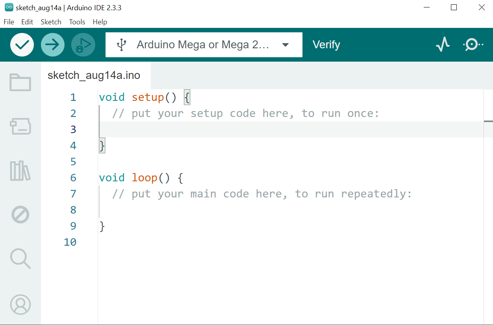

# :electric_plug: Servomotor

Este documento detalla las librerías a usar, conexiones y ejecución de proyectos en los que se usa un **motores** con Arduino.

Proyectos:

1. Control básico de servomotor con Arduino.

Esta carpeta contiene ejemplos prácticos para la conexión y modificación de Script y ejecución del proyecto.

---

## :open_file_folder: Archivos incluidos

| Archivo         | Descripción                       |
| --------------- | --------------------------------- |
| servo_motor.ino | Proyecto de control de servomotor |

---

## :wrench: Requisitos de Hardware

- Arduino MEGA.
- Servomotor SG90 o similar.
- Potenciómetro (opcional para control manual).
- Fuente de alimentación adecuada (si se requiere).

---

## 1. :inbox_tray: Instalar Arduino IDE

Como primer paso tener instalado el IDE de Arduino para poder compilar el código al Arduino MEGA.  
Si no cuenta con este software podrá descargarlo siguiendo los pasos aquí mencionados:

1. Ve al sitio oficial: [https://www.arduino.cc/en/software](https://www.arduino.cc/en/software)
2. Descarga la versión para tu sistema operativo (Windows, macOS o Linux).
3. Instala Arduino IDE siguiendo las instrucciones del instalador.

## 

---

## 2. :ballot_box_with_check: Instalar las librerías requeridas

Arduino IDE **ya incluye la librería Servo** por defecto, pero si no está disponible puedes instalarla de la siguiente forma:

### 2.1 Abre Arduino IDE.

### 2.2 Ve a **Programa > Incluir Librería > Administrar Bibliotecas**.

### 2.3 Buscar e instalar.

#### 2.3.1 **Servo by Arduino**

## 

---

## 3. Conectar la placa Arduino

1. Conecta tu placa Arduino al computador usando un cable USB.
2. Espera a que el sistema reconozca el dispositivo.

---

## 4. Configurar Arduino IDE

1. Ve a **Herramientas > Placa** y selecciona el modelo de tu placa (Arduino Mega).
2. Ve a **Herramientas > Puerto** y selecciona el puerto COM correspondiente.

---

# :checkered_flag: Proyecto

## 1. Proyecto de control básico de servomotor

Este proyecto permite mover un **servomotor** de 0° a 180° mediante Arduino.

- Servomotor
  | Pin Servomotor | Pin Arduino MEGA |
  |----------------|------------------|
  | VCC (Rojo) | 5V |
  | GND (Café/Negro) | GND |
  | Señal (Naranja/Amarillo) | 9 |

- Potenciómetro (opcional)
  | Pin Potenciómetro | Pin Arduino MEGA |
  |-------------------|------------------|
  | VCC | 5V |
  | GND | GND |
  | OUT | A0 |

---

## 2. Abrir y cargar el código

1. Ve a **Archivo > Abrir** y selecciona `servo_motor.ino`.
2. Haz clic en **Verificar** (✓) para compilar el código.
3. Haz clic en **Subir** (→) para cargar el código a la placa.

---

## 3. Probar el sistema

- Gira la perilla del potenciometro
- Verifica que el servomotor se mueve a raiz del giro del potenciometro
