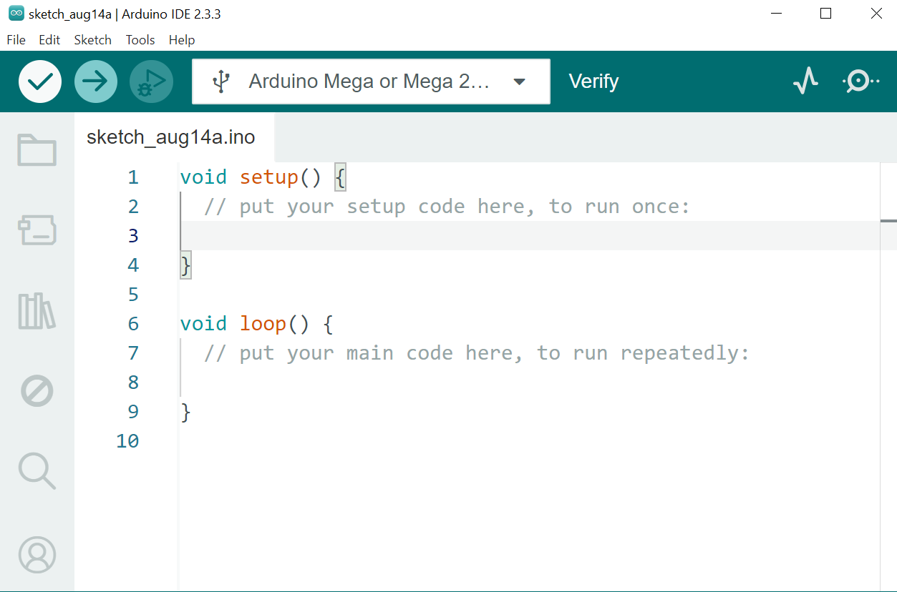

# :satellite: Sensores

Este documento detalla las librerias a usar, conexiones y ejecucion de proyectos en los que se usan distintos sensores.

Proyectos:

1. Medidor de Umbral de Ruido.

Esta carpeta contiene ejemplos prácticos para la conexion y modificacion de Script y ejecucion de cada proyecto.

---

## :open_file_folder: Archivos incluidos

| Archivo                  | Descripción                            |
| ------------------------ | -------------------------------------- |
| microphone_led_strip.ino | Proyecto de Medidor de Umbral de Ruido |

---

## :wrench: Requisitos de Hardware

- Arduino MEGA.
- Micrófono con salida digital LM393.
- Regleta de LEDs WS2812.

---

## 1. :inbox_tray: Instalar Arduino IDE

Como primer paso tener instalado el IDE de Arduino para poder compilar el codigo al arduino MEGA, Si no cuenta con esté software podrá descargarlo siguiendo los pasos aqui mencionados:

1. Ve al sitio oficial: [https://www.arduino.cc/env/software](https://www.arduino.cc/en/software)
2. Descarga la versión para tu sistema operativo (Windows, macOS o Linux).
3. Instala Arduino IDE siguiendo las instrucciones del instalador.

## 

---

## 2. :ballot_box_with_check: Instalar las librerias requeridas

Esta seccion es necesaria debido a que Arduino IDE no cuenta con librerias especificas para los distintos modulos y fabricantes, aqui vamos a instalar solo las requeridas para los distintos proyectos.

### 2.1 Abre Arduino IDE.

### 2.2 Ve a **Programa > Incluir Librería > Administrar Bibliotecas**.

## 

### 2.3 Buscar e Instalar.

#### 2.3.1 **Adafruit NeoPixel**

## 

---

## 3. Conectar la placa Arduino

1. Conecta tu placa Arduino al computador usando un cable USB.
2. Espera a que el sistema reconozca el dispositivo.

## 4. Configurar Arduino IDE

1. Ve a **Herramientas > Placa** y selecciona el modelo de tu placa (por ejemplo, Arduino Uno).
2. Ve a **Herramientas > Puerto** y selecciona el puerto COM correspondiente.

# :checkered_flag: Proyectos.

## 1. Proyecto de Medidor de Umbral de Ruido

Este proyecto hace uso el Microfono de señales digitales y la regleta de LEDs WS2812 y hacer un efecto fantastico de luces secuenciales cada vez que el microfono detecta ruido, por cada frecuencia alta o baja el efecto de luces sube o baja de manera dinamica, se puede austar el nivel de sensibilidad en el potenciometro del modulo o tambien en el nivel de umbral en el codigo y otras configuraciones mas.

### 1.1 Conexiones

- Tira LED WS2812
  | Pin Modulo | Pin Arduino MEGA |
  |------------ |------------------|
  | VCC | 5V |
  | GND | GND |
  | VIN | 6 |
- Microfono LM393
  | Pin Modulo | Pin Arduino MEGA|
  |------------|-----------------|
  | VCC | 5V |
  | GND | GND |
  | S | A0 |

## 2 Abrir y cargar el codigo

1. Ve a **Archivo > Abrir** y selecciona `microphone_led_strip.ino`.
2. Haz clic en **Verificar** (✓) para compilar el código.
3. Haz clic en **Subir** (→) para cargar el código a la placa.

## 7. Probar el sistema

- Habla o haz ruido cerca del micrófono.
- Observa cómo los LEDs se iluminan según el nivel detectado.
- Ajusta el Potenciometro para cambiar la sensibilidad.

## 8. Realiza ajustes

Cambiar el brillo de los LEDs

```c
strip.setBrightness(10);
```

> valores entre 0 y 255

```c
strip.Color(0, 255, 0);
```

> Valores RGB (Red, Green, Blue), cada uno de 0 a 255

```c
int nivelSuavizado = 0; // Para suavizar el movimiento
int caida = 0; // para suavicar cuando el umbral baja
```

> Esto puede ajustar la rapidez o la suavidad con la que los les hacen transicion de encendido y apagado

¡Listo! Tu sistema de tira LED reactiva al sonido está

---
